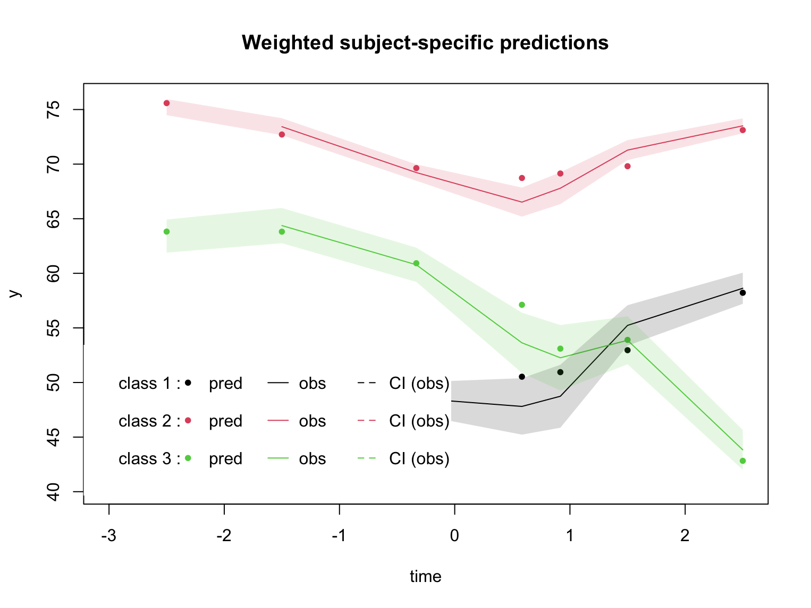

# for-better-or-worse
Follow-up to [shit-happens](https://github.com/datarichard/shit-happens).  

This project describes the heterogeneity of happiness trajectories around life events.  

It uses the [lcmm](https://cecileproust-lima.github.io/lcmm/index.html) package to estimate a **latent class linear mixed model** with `hlme()` on happiness scores around distinct life events (e..g, `lefnw`) from the HILDA survey.  

  
<br>

***  

### Bankruptcy example  

Using `ghmh` scores from each person in HILDA (`xwaveid`) who experienced bankruptcy (`lefnw`) arranged along the peristimulus time of the event (`time`):  

```
> head(lefnw)
  xwaveid       time ghmh  sex
1  100003 -3.0000000   76 Male
2  100003 -2.0000000   80 Male
3  100003 -1.0000000   68 Male
4  100003  0.3333333   64 Male
5  100003  1.0000000   76 Male
6  100003  3.0000000   80 Male
```

    
<br>
  
#### Fit a model for 3 classes  

`hlme` allows non-linear growth using quadratic and 
cubic trends, and can also handle unbalanced longitudinal data.  

```
hlme(ghmh ~ time + I(time^2) + I(time^3) + sex,
       random =~ time + I(time^2) + I(time^3), # omit this line to remove RE 
       subject = 'xwaveid', 
       data = fdf, 
       ng = 3,                                 # number of classes
       nproc = 3,
       mixture =~time + I(time^2) + I(time^3))
```

NB. No starting values were provided and `gridsearch()` is usually recommended.  
  
<br>
  
#### Evaluate the quality of classification  

Check the size and distinctiveness of each class. _Mean posterior probabilities_ greater than 70% are acceptable (*mpp* > 80% are good).  

```
> postprob(m3)         
 
Posterior classification: 
  class1  class2 class3
N 355.00 2282.00  81.00
%  13.06   83.96   2.98
 
Posterior classification table: 
     --> mean of posterior probabilities in each class 
        prob1  prob2  prob3
class1 0.7862 0.1657 0.0481
class2 0.0531 0.8963 0.0506
class3 0.0527 0.2142 0.7331
 
Posterior probabilities above a threshold (%): 
         class1 class2 class3
prob>0.7  66.76  89.40  53.09
prob>0.8  54.65  81.81  35.80
prob>0.9  35.49  67.22  24.69
```

The three classes distinguished by this model are dominated by a single class (`class2` is 83.96% of cases). The _mean posterior probablities_ of each class are acceptable (lowest _mpp_ is `0.7331`), however the _individual posterior probabilities_ for some classes are poor (e.g., `class3` 53.09%). This indicates a substantial proportion of individuals are not strongly classified into `class1` or `class3`, perhaps due to overlapping trajectories or too many classes in the model. A potential fix would be to add class predictors to the model (via the `classmb` arguement).     

  
<br>
  
#### Examine the predicted trajectory versus mean (95%CI) observed trajectory  

```
plot(m3, which="fit", var.time="time", marg=FALSE, shades = TRUE)  
```

<!-- -->  

Three classes were identified with distinct trajectories, however some predicted values fell outside the 95%CI expected range of the observed mean values. Overall the model predictions did not capture the observed trajectories with sufficient precision.  

Given the domination by a single class (`class2`), ambiguous classification of individuals between the other two smallest classes, and imprecise trajectory fit, the results do not support clear heterogeneity in response to bankruptcy.  


